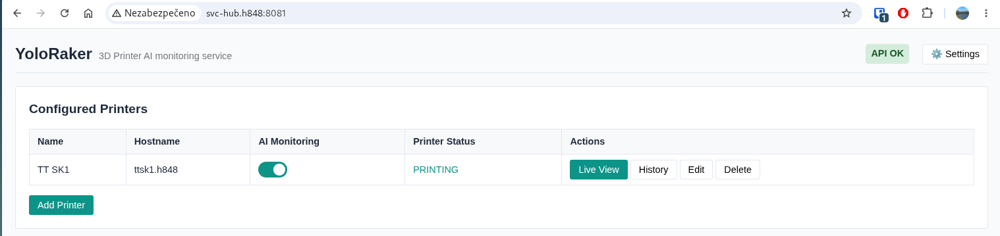
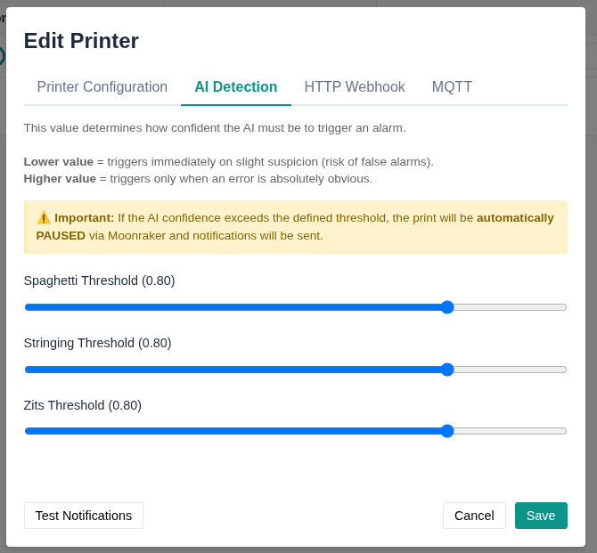
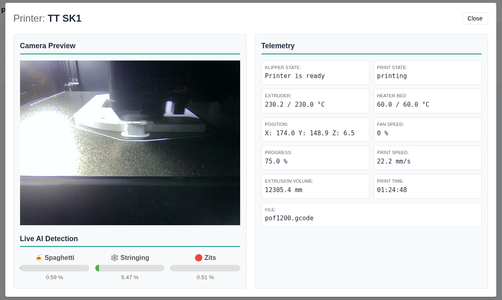
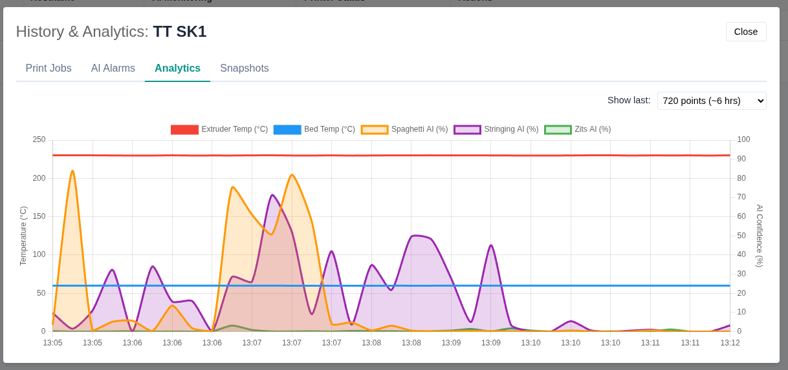

# YoloRaker


*🌐 [English](README.md) | [Čeština](README.cs.md)*

YoloRaker is a lightweight, AI-powered companion application for 3D printers running Klipper and Moonraker. It provides a clear dashboard for real-time monitoring, telemetry tracking, and automated print failure detection using local machine learning.









## Key Features

* **AI Print Failure Detection:** Real-time visual analysis of your webcam feed to detect spaghetti, stringing, and zits before they ruin your print. Runs 100% locally on CPU without external cloud services.
* **Auto-Pause:** Automatically pauses the print via Moonraker if AI confidence exceeds your defined thresholds.
* **Telemetry & Analytics:** Tracks extruder/bed temperatures, print speed, progress, and AI confidence levels over time.
* **Notifications:** Built-in support for Webhooks and MQTT to alert you via Home Assistant, Node-RED, or Discord.
* **Web UI:** A clear and intuitive dashboard to monitor your printers and their AI detection status.
* **Timelapse & Snapshots:** Periodically saves webcam snapshots during active prints and allows playing them back as a timelapse in the history viewer.
* **Smart Data Retention:** Automatically cleans up old telemetry, snapshots, and alarm data while keeping a defined number of recent prints safe.

## Tech Stack

* **Backend:** Java 25, Javalin (Web Framework), JDBI v3 (Database Mapping), H2 (Embedded Database)
* **Frontend:** Vanilla JavaScript, HTML5, CSS3, Chart.js
* **AI/ML:** ONNX Runtime for Java (YOLOv8 models)

## Docker Image

A pre-built, ready-to-use Docker container is available on Docker Hub. For installation instructions, configuration details, and docker-compose examples, please visit the official Docker Hub repository:

**[https://hub.docker.com/r/h848/yoloraker](https://hub.docker.com/r/h848/yoloraker)**

## Configuration

1. Open your browser and navigate to `http://<your-ip>:8080`
2. Log in with the default credentials:
   * **Username:** `admin`
   * **Password:** `admin`
3. Immediately go to Settings to change your default password!
4. Click Add Printer and enter your Moonraker IP/Hostname and Webcam URL.

## Development

If you want to build YoloRaker from source:

### Prerequisites
* Java JDK 25+
* Maven 3.8+

### Build & Run
```bash
# Clone the repository
git clone https://github.com/h848/yoloraker.git
cd yoloraker

# Compile and package
mvn clean package

# Run the application
java -jar target/YoloRaker-1.0.0-jar-with-dependencies.jar
```

The application will start on port 8080 by default. Data is stored locally in the `./data` directory relative to the execution path.

## License
This project is licensed under the MIT License - see the LICENSE file for details.
