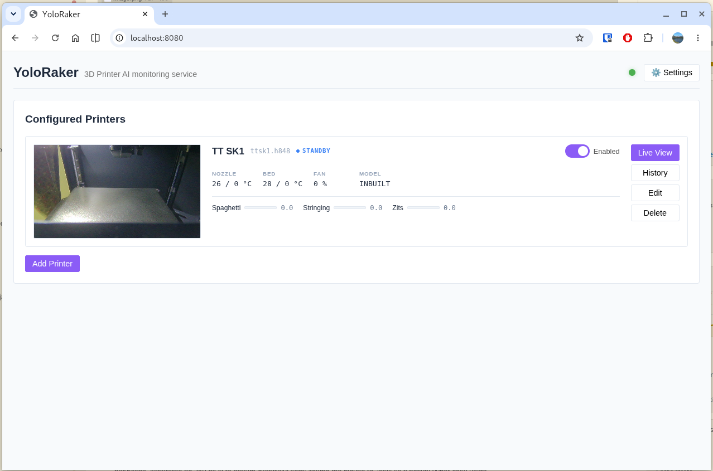
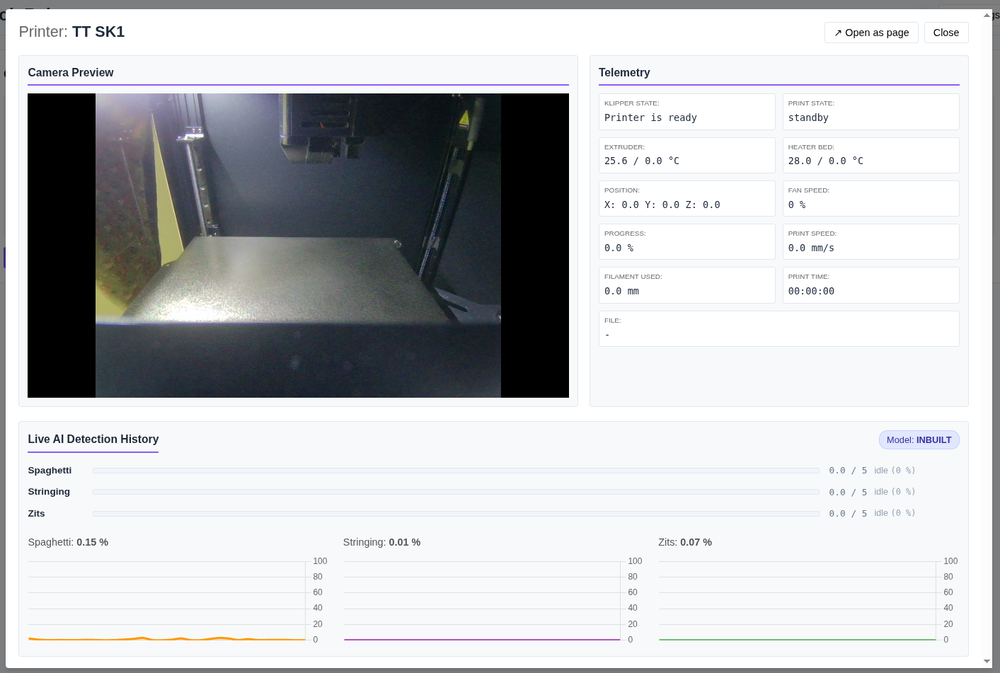

# YoloRaker


*🌐 [English](README.md) | [Čeština](README.cs.md)*

YoloRaker is a lightweight, AI-powered companion application for 3D printers running Klipper and Moonraker. It watches your webcam feed for print failures, tracks telemetry, and can pause a print before it turns into a bird's nest — running entirely on your own hardware, on CPU, with no cloud service involved.






## Key Features

* **AI Print Failure Detection** — Real-time visual analysis of your webcam feed for spaghetti, stringing and zits. 100% local, CPU only.
* **Sensor Fusion** — Every detection is cross-checked against printer telemetry *and* against what this particular print has looked like so far, which is what suppresses false alarms from purge lines, exposed infill and tree supports. See [How a detection becomes an alarm](#how-a-detection-becomes-an-alarm).
* **Only real failures stop a print** — Spaghetti pauses the print via Moonraker. Stringing and zits are surface-quality defects that pausing cannot repair, so they are reported and logged while the print continues.
* **Shadow mode** — Fusion can run in a record-only mode so you can see what it *would* have decided before letting it decide anything.
* **Confirmation levels, not raw percentages** — The dashboard shows how close each class is to acting, so you get a warning before a pause rather than a percentage that spikes and means nothing.
* **Incident review** — Mark each incident as a real failure or a false alarm. Reviewed incidents are kept permanently as training data for future model tuning.
* **Continuous telemetry** — Printers are sampled once a second, independently of the UI, so charts have real resolution and printer load stays constant no matter how many dashboards are open.
* **Notifications** — Webhooks and MQTT for Home Assistant, Node-RED, Discord and friends.
* **Timelapse & Snapshots** — Periodic webcam snapshots during a print, played back in the history viewer.
* **Simple retention** — Choose how many recent prints to keep. Everything belonging to them is kept; everything older goes.

## Tech Stack

* **Backend:** Java 25, Javalin (web framework), JDBI v3 (database mapping), H2 (embedded database)
* **Frontend:** Vanilla JavaScript, HTML5, CSS3, Chart.js
* **AI/ML:** ONNX Runtime for Java (YOLOv8/YOLOv11 models)

No build step for the frontend, no CDN dependencies — the whole UI works on an isolated printer network with no internet access.

## How a detection becomes an alarm

This is the part worth understanding, because it is what makes the difference between a useful monitor and one you learn to ignore.

**1. The model scores a frame.** The ONNX model returns a confidence for each class.

**2. The baseline gate.** A purge line sitting in the camera's view, exposed zigzag infill or tree supports all look like a defect to the model — and no amount of printer telemetry can tell them apart from a real failure, because the printer behaves perfectly in all of those cases. What *does* tell them apart is time. YoloRaker keeps a rolling low percentile of each class's score over the last 20 minutes of the current print, and judges a detection by how far it rises **above that baseline**. Scenery raises the baseline with it and stays quiet; a failure that develops in a minute or two leaves the baseline behind and stands out.

**3. Telemetry suppressors.** The 10-second telemetry window ending at the camera frame can slow a detection down — nothing extruded, nozzle still heating, the first ninety seconds of a print, just resumed after a pause. Crucially these **slow the rate, they never edit the score**: a real failure persists frame after frame and still accumulates, only later. Suppression delays; it can never mask.

**4. Confirmation level.** Each frame adds to a per-class level scaled by how confident the model was; a clean frame subtracts from it. An alarm fires when the level reaches 5. A marginal detection takes around 50 seconds to confirm, a confident one around 30 — where the old fixed counter took 50 seconds either way.

**5. The action.** Spaghetti pauses the print. Stringing and zits notify, at most once per class per print.

Two safety properties are deliberate and are not configurable:

* A very confident detection (≥ 0.90) ignores every telemetry suppressor. Suppressors are inferences about context and can be wrong.
* It does **not** ignore the baseline. That is a measurement of what this print actually looks like, and it is trusted over any inference.

### Fusion modes

Set in **Settings → AI Engine**:

| Mode | Behaviour |
|---|---|
| `OFF` | Fusion is not evaluated. Raw model scores drive the decision. |
| `SHADOW` *(default)* | Fusion is evaluated and recorded, but the raw score still decides. The safe way to gather a few days of real data first. |
| `ACTIVE` | Fusion decides. |

The pause/notify split applies in **all** modes — it is a policy, not part of fusion.

Once you have a few days of shadow data, **History & Analytics → Analytics** shows how often each path would have acted, with a breakdown of which rules held fusion back.

## Docker Image

A pre-built container is available on Docker Hub. For installation instructions, configuration details and docker-compose examples:

**[https://hub.docker.com/r/h848/yoloraker](https://hub.docker.com/r/h848/yoloraker)**

### Environment variables

| Variable | Default | Purpose |
|---|---|---|
| `YOLORAKER_PORT` | `8080` | HTTP port |
| `YOLORAKER_DB_PATH` | `./data/yoloraker` | H2 database path (without extension) |
| `YOLORAKER_DATA_PATH` | `./data` | Snapshots and uploaded models — point at a mounted volume |
| `YOLORAKER_TELEMETRY_INTERVAL_MS` | `1000` | Telemetry sampling period. Minimum 200 ms; `0` disables continuous collection and falls back to per-request queries. |

## Configuration

1. Open `http://<your-ip>:8080`
2. Log in with the default credentials — **`admin` / `admin`**
3. Go to Settings and change the password immediately
4. Click **Add Printer** and enter your Moonraker IP/hostname and webcam URL

Detection classes, their thresholds and the AI model are per printer, in **Edit Printer → AI Detection**.

## Development

### Prerequisites
* Java JDK 25+
* Maven 3.8+

### Build & Run
```bash
# Clone the repository, then:
mvn clean package
java -jar target/YoloRaker-1.1.0.jar
```

The application starts on port 8080. Data is stored in `./data` relative to the working directory. Database migrations run automatically on startup — upgrading in place is safe and no existing data is dropped.

## Known limitations

* **"Allow access without auth" still requires an `Authorization` header.** The check for the setting happens after the header check, so a browser (which caches credentials) works fine but a bare API client gets a 401.
* **An AI pause splits a print in the history.** Pausing via AI closes the job record, so resuming starts a second record for the same physical print.
* **Detection scores are a maximum over all anchors**, without NMS or any regard for area, so a single noisy region anywhere in the frame can raise a class. Anchor counts are recorded alongside (`anchors_*` in `telemetry_logs`) to evaluate a more robust aggregation.

## Changelog

### v1.1.0 (Latest)

The headline of this release is **sensor fusion**: detections are no longer judged on the model score alone.

**Sensor fusion**
* **Continuous telemetry collection.** A new telemetry service samples each printer once a second and aggregates 10-second windows (distance travelled, filament extruded, Z delta, temperature drift and spread, heater duty). Windows are aligned to the moment a camera frame was captured, not to when it was processed.
* **Adaptive baseline.** A rolling 20th percentile of each class's score over the last 20 minutes of the current print. A detection is judged by its excursion above that baseline, which is what neutralises purge lines, exposed infill and tree supports.
* **Telemetry suppressors** — `NO_EXTRUSION`, `NOT_AT_TEMP`, `EARLY_PRINT`, `JUST_RESUMED` for spaghetti; `TRAVEL_HEAVY` amplifies stringing, since strings are drawn during travel moves.
* **Suppressors scale the confirmation rate, never the score.** Multiplying a score down risks pushing a genuine failure permanently under the threshold. Scaling the rate means suppression delays an alarm but can never prevent one.
* **High-confidence override** at 0.90 ignores every suppressor, but never the baseline.
* **Confidence-weighted confirmation** replaces the fixed "5 consecutive detections". A confident detection now confirms in about 30 seconds instead of 50; a marginal one still takes the full 50.
* **Baseline saturation warning.** When the learned baseline leaves the model no headroom, the printer card says so and explains that the fix is the camera angle, not a threshold.
* **Shadow / Active / Off modes**, defaulting to Shadow.

**Detection policy**
* **Only spaghetti pauses a print.** Stringing and zits are surface-quality defects; they are now reported and logged while the print continues, limited to one notification per class per print. Applies in every fusion mode.
* `ai_alarms` records what was actually done (`PAUSED` / `NOTIFIED`). Pre-existing rows read as `PAUSED`, which is what they were.

**Incident review (groundwork for model retraining)**
* Every incident can be marked a real failure or a false alarm from **History & Analytics → Incidents**.
* **Reviewed incidents are never deleted by retention**, regardless of age — they are training data.

**Retention, simplified**
* Three separate row caps (telemetry points, alarms, print jobs) are replaced by **one setting: how many recent prints to keep**. Everything belonging to those prints — telemetry, incidents, snapshots — is kept; everything older is dropped.
* Upgrading adopts your previous print-job limit so no history is silently deleted. Check it in Settings; under the new meaning it may be more than you need.
* Orphaned snapshot folders left behind by older versions are now cleaned up.
* An internal cap bounds telemetry for a printer that has never printed, where there is no print to anchor retention to.

**Moonraker client**
* Split into separate info and object queries. The 1 Hz path no longer fetches the Klipper host state on every tick; it is refreshed every 10 seconds instead.
* Reads `motion_report.live_position` — where the toolhead actually is — instead of the planned position, which runs ahead of what has physically been printed. Falls back to the planned position if `motion_report` is unavailable.
* Reads `extruder.power`, needed to distinguish "cooling because the target changed" from "cooling at full heater power", i.e. a clog.
* An unreachable printer is reported once per outage, not once per poll.

**User interface**
* **Printer cards** replace the table: live camera preview, progress bar, elapsed and estimated remaining time, filament, speed, height, temperatures, fan and active model — plus a confirmation meter per class.
* **Confirmation level is the headline number**, not instantaneous confidence, with a plain-language reason (`idle`, `at scenery level`, `building`, `pausing in ~15 s`).
* **Analytics rebuilt as a fusion cockpit** — three panels over a shared time axis, each with its baseline band, threshold line and hatching where suppressors were active. Alarm events are pinned, and hovering shows the rules that fired. A comparison strip reports how often each decision path would have acted. A table view is always available.
* **The dual-axis Analytics chart is gone.** Temperatures now have their own chart behind a toggle instead of sharing a frame with AI confidence on a second scale.
* **Live View can be opened as a full page** (`#live/<printerId>`), bookmarkable and suitable for a second monitor, and its contents are around 20% denser.
* Detection class switches moved from the overview into **Edit Printer → AI Detection**, each paired with its own threshold.
* Incidents show a `PAUSED` / `NOTIFIED` badge.
* History & Analytics no longer resizes when switching tabs.

**Diagnostics**
* Telemetry rows now also record the baseline per class, the suppression factor, the rules that fired, the aggregated telemetry window, and the number of anchors above 0.5 per class — the last of these to evaluate whether a count is a better signal than a maximum.

**Fixes**
* The camera placeholder no longer stacks up a copy of itself on every refresh of an offline camera.
* The fusion baseline survives an AI pause. It was keyed on the print-job row, which an AI pause closes, wiping the baseline exactly when the scene is least likely to have changed.
* The Cancel button in Edit Printer no longer throws a `ReferenceError`; the handler it referenced never existed.
* Long filenames no longer stretch a printer card past its column.
* The aggregated telemetry window is no longer serialised into history responses, where it added megabytes and was never read.

### v1.0.5
**Reliability & Bug Fixes:**
* **Camera Resilience:** A webcam outage (timeout or HTTP error) no longer aborts the whole detection cycle. Telemetry logging, print-job tracking and notifications keep working; the AI detection simply degrades gracefully. The webcam is now fully optional.
* **Decoupled Telemetry:** Telemetry and print history are now recorded independently of the webcam, so printers without a camera still get full history and analytics.
* **Print-Job Integrity:** Pausing and resuming a print no longer fragments a single physical print into multiple history records — a pause is now correctly treated as an ongoing job.
* **Fixed Printer Deletion (HTTP 500):** Deleting a printer failed with a referential-integrity error because the deletion event referenced the just-removed printer. The event is now logged without the foreign key.
* **Offline-Ready Dashboard:** Chart.js is now bundled locally instead of being loaded from a CDN, so all dashboard charts work on isolated printer networks with no internet access.
* **ONNX Memory Leak:** Native ONNX inference sessions are now properly released when a printer's model is reassigned and on shutdown.
* **Parallel Detection Loop:** Printer checks now run on a worker pool with a per-printer guard, so a single slow or offline printer no longer delays detection for the others.
* **Custom Model Robustness:** The inference post-processing now validates the output tensor shape and tolerates transposed model outputs, making custom `.onnx` uploads more reliable.
* **UI Fix:** The System Settings dialog no longer changes size when switching between its tabs.

**Security:**
* **Authentication On by Default:** Fresh installs now start with authentication enabled (previously it was disabled by default).
* **Hashed Admin Password:** The admin password is stored as a salted PBKDF2 hash instead of plaintext. Existing plaintext passwords are transparently upgraded to a hash on the next successful login.
* **Path-Traversal Protection:** The snapshot file endpoints now reject unsafe path segments.

**Docker:**
* **Persistent Snapshots & Models:** Snapshots and uploaded custom models are now written to the mounted `/data` volume (`YOLORAKER_DATA_PATH`), preventing their loss when the container is recreated.

### v1.0.4
**New Features & Enhancements:**
* **Custom AI Models Support**: Upload and manage multiple custom YOLO (.onnx) models via System Settings.
* **Per-Printer AI Model Assignment**: You can now select a specific AI model for each individual printer directly in the Edit Printer dialog, allowing you to use different models for different cameras or lighting conditions.
* **Moonraker Screen Integration**: Added the ability to send AI detection status and progress directly to Mainsail, Fluidd, or KlipperScreen via Moonraker (using M117 commands).
* **Live Dashboard Revamp**: Redesigned the Dashboard UI. The camera feed and telemetry are now aligned side-by-side at the top with a native 16:9 aspect ratio.
* **Real-time AI Analytics**: Added three live, real-time charts to the Dashboard to instantly track detection confidence (Spaghetti, Stringing, Zits) over the last 30 readings.
* **UI Polish**: Refined modal dialogs to maintain strict uniform sizing during tab navigation, slightly reduced global font sizing for a cleaner look, and replaced the bulky API status label with a subtle indicator dot.

### v1.0.3
**New Features & Enhancements:**
* **Granular AI Detection Toggles**: You can now enable or disable specific detection classes (Spaghetti, Stringing, Zits) directly from the dashboard table.
* **Modernized UI**: Updated the primary color scheme to a modern Violet/Purple and unified the UI toggle switches for a more premium look.
* **Improved AI Stability**: Increased the required number of consecutive detections from 3 to 5 to significantly reduce false positive alarms (especially for stringing).
* **Robust MQTT Handling**: The MQTT broker URL now automatically corrects missing protocols (e.g. prepends `tcp://` automatically).
* **Automated Docker Builds**: The `Dockerfile` now uses a wildcard to automatically handle version bumps.

**Bug Fixes:**
* **Webhook Communication Fix**: Forced `HTTP_1_1` to resolve random `EOFException` / `received no bytes` errors when communicating with Node-RED and other webhook receivers.
* **JSON Payload Fix**: Enforced `Locale.US` during JSON serialization to prevent payload corruption (commas vs. dots in decimal numbers) on non-US host systems.
* **Moonraker Pause Fix**: Switched from Moonraker's standard pause API to directly executing the `PAUSE` G-Code script for 100% reliable print pausing.
* **UI Bug Fixes**: Fixed the jumping height of the Edit Printer modal, moved the "Test Notifications" button to the correct tabs, and fixed the JavaScript bindings for the test button.
* **Label Correction**: Renamed the confusing "Extrusion Volume" telemetry metric to "Filament Used" (mm).

## License
This project is licensed under the MIT License - see the LICENSE file for details.
