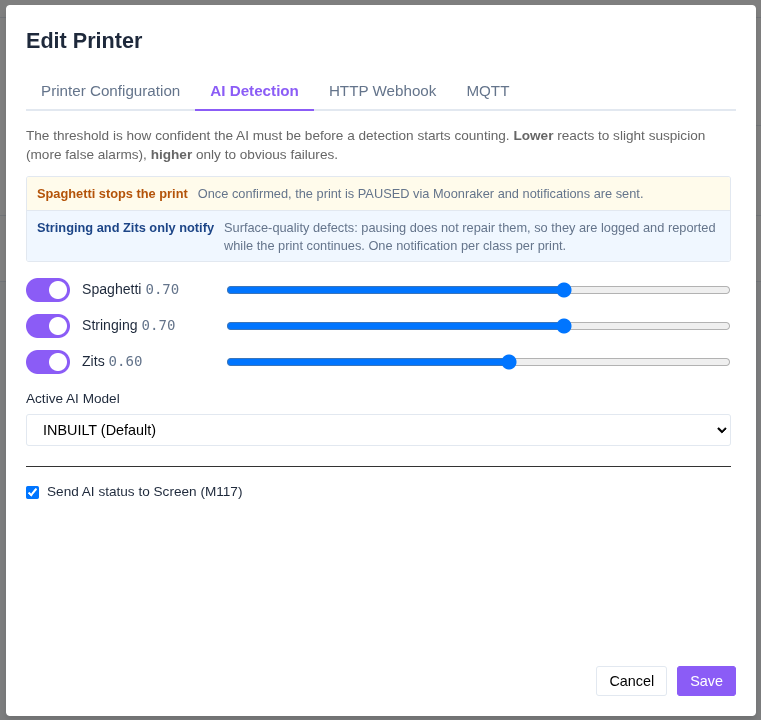
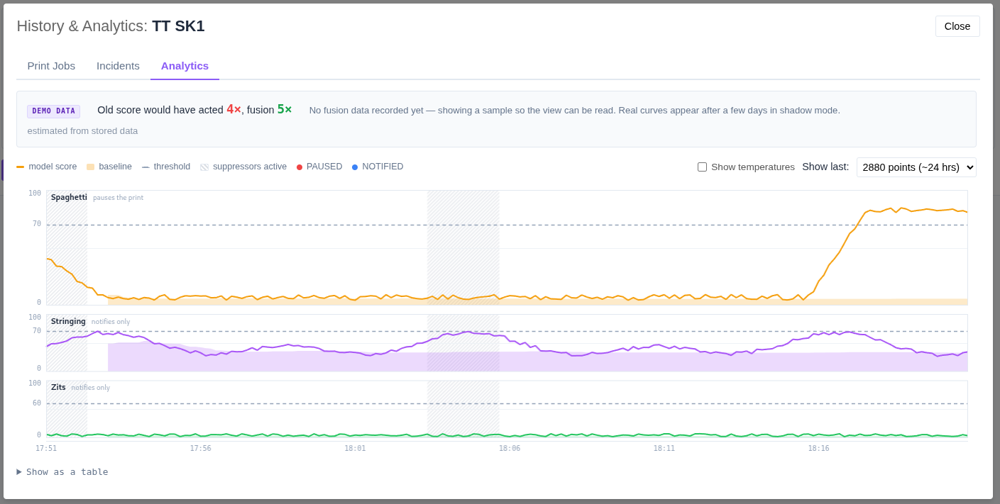

# YoloRaker


*🌐 [English](README.md) | [Čeština](README.cs.md)*

YoloRaker is a lightweight, AI-powered companion application for 3D printers running Klipper and Moonraker. It provides a clear dashboard for real-time monitoring, telemetry tracking, and automated print failure detection using local machine learning.







## Key Features

* **AI Print Failure Detection:** Real-time visual analysis of your webcam feed to detect spaghetti, stringing, and zits before they ruin your print. Runs 100% locally on CPU without external cloud services.
* **Auto-Pause:** Automatically pauses the print via Moonraker if AI confidence exceeds your defined thresholds.
* **Telemetry & Analytics:** Tracks extruder/bed temperatures, print speed, progress, and AI confidence levels over time.
* **Notifications:** Built-in support for Webhooks and MQTT to alert you via Home Assistant, Node-RED, or Discord.
* **Web UI:** A clear and intuitive dashboard to monitor your printers and their AI detection status.
* **Timelapse & Snapshots:** Periodically saves webcam snapshots during active prints and allows playing them back as a timelapse in the history viewer.
* **Smart Data Retention:** Automatically cleans up old telemetry, snapshots, and alarm data while keeping a defined number of recent prints safe.

## Tech Stack

* **Backend:** Java 25, Javalin (Web Framework), JDBI v3 (Database Mapping), H2 (Embedded Database)
* **Frontend:** Vanilla JavaScript, HTML5, CSS3, Chart.js
* **AI/ML:** ONNX Runtime for Java (YOLOv8/YOLOv11 models)

## Docker Image

A pre-built, ready-to-use Docker container is available on Docker Hub. For installation instructions, configuration details, and docker-compose examples, please visit the official Docker Hub repository:

**[https://hub.docker.com/r/h848/yoloraker](https://hub.docker.com/r/h848/yoloraker)**

## Configuration

1. Open your browser and navigate to `http://<your-ip>:8080`
2. Log in with the default credentials:
   * **Username:** `admin`
   * **Password:** `admin`
3. Immediately go to Settings to change your default password!
4. Click Add Printer and enter your Moonraker IP/Hostname and Webcam URL.

## Development

If you want to build YoloRaker from source:

### Prerequisites
* Java JDK 25+
* Maven 3.8+

### Build & Run
```bash
# Clone the repository
git clone https://github.com/h848/yoloraker.git
cd yoloraker

# Compile and package
mvn clean package

# Run the application
java -jar target/YoloRaker-1.0.5.jar
```

The application will start on port 8080 by default. Data is stored locally in the `./data` directory relative to the execution path.

## Changelog

### v1.0.5 (Latest)
**Reliability & Bug Fixes:**
* **Camera Resilience:** A webcam outage (timeout or HTTP error) no longer aborts the whole detection cycle. Telemetry logging, print-job tracking and notifications keep working; the AI detection simply degrades gracefully. The webcam is now fully optional.
* **Decoupled Telemetry:** Telemetry and print history are now recorded independently of the webcam, so printers without a camera still get full history and analytics.
* **Print-Job Integrity:** Pausing and resuming a print no longer fragments a single physical print into multiple history records — a pause is now correctly treated as an ongoing job.
* **Fixed Printer Deletion (HTTP 500):** Deleting a printer failed with a referential-integrity error because the deletion event referenced the just-removed printer. The event is now logged without the foreign key.
* **Offline-Ready Dashboard:** Chart.js is now bundled locally instead of being loaded from a CDN, so all dashboard charts work on isolated printer networks with no internet access.
* **ONNX Memory Leak:** Native ONNX inference sessions are now properly released when a printer's model is reassigned and on shutdown.
* **Parallel Detection Loop:** Printer checks now run on a worker pool with a per-printer guard, so a single slow or offline printer no longer delays detection for the others.
* **Custom Model Robustness:** The inference post-processing now validates the output tensor shape and tolerates transposed model outputs, making custom `.onnx` uploads more reliable.
* **UI Fix:** The System Settings dialog no longer changes size when switching between its tabs.

**Security:**
* **Authentication On by Default:** Fresh installs now start with authentication enabled (previously it was disabled by default).
* **Hashed Admin Password:** The admin password is stored as a salted PBKDF2 hash instead of plaintext. Existing plaintext passwords are transparently upgraded to a hash on the next successful login.
* **Path-Traversal Protection:** The snapshot file endpoints now reject unsafe path segments.

**Docker:**
* **Persistent Snapshots & Models:** Snapshots and uploaded custom models are now written to the mounted `/data` volume (`YOLORAKER_DATA_PATH`), preventing their loss when the container is recreated.

### v1.0.4
**New Features & Enhancements:**
* **Custom AI Models Support**: Upload and manage multiple custom YOLO (.onnx) models via System Settings.
* **Per-Printer AI Model Assignment**: You can now select a specific AI model for each individual printer directly in the Edit Printer dialog, allowing you to use different models for different cameras or lighting conditions.
* **Moonraker Screen Integration**: Added the ability to send AI detection status and progress directly to Mainsail, Fluidd, or KlipperScreen via Moonraker (using M117 commands).
* **Live Dashboard Revamp**: Redesigned the Dashboard UI. The camera feed and telemetry are now aligned side-by-side at the top with a native 16:9 aspect ratio.
* **Real-time AI Analytics**: Added three live, real-time charts to the Dashboard to instantly track detection confidence (Spaghetti, Stringing, Zits) over the last 30 readings.
* **UI Polish**: Refined modal dialogs to maintain strict uniform sizing during tab navigation, slightly reduced global font sizing for a cleaner look, and replaced the bulky API status label with a subtle indicator dot.

### v1.0.3
**New Features & Enhancements:**
* **Granular AI Detection Toggles**: You can now enable or disable specific detection classes (Spaghetti, Stringing, Zits) directly from the dashboard table.
* **Modernized UI**: Updated the primary color scheme to a modern Violet/Purple and unified the UI toggle switches for a more premium look.
* **Improved AI Stability**: Increased the required number of consecutive detections from 3 to 5 to significantly reduce false positive alarms (especially for stringing).
* **Robust MQTT Handling**: The MQTT broker URL now automatically corrects missing protocols (e.g. prepends `tcp://` automatically).
* **Automated Docker Builds**: The `Dockerfile` now uses a wildcard to automatically handle version bumps.

**Bug Fixes:**
* **Webhook Communication Fix**: Forced `HTTP_1_1` to resolve random `EOFException` / `received no bytes` errors when communicating with Node-RED and other webhook receivers.
* **JSON Payload Fix**: Enforced `Locale.US` during JSON serialization to prevent payload corruption (commas vs. dots in decimal numbers) on non-US host systems.
* **Moonraker Pause Fix**: Switched from Moonraker's standard pause API to directly executing the `PAUSE` G-Code script for 100% reliable print pausing.
* **UI Bug Fixes**: Fixed the jumping height of the Edit Printer modal, moved the "Test Notifications" button to the correct tabs, and fixed the JavaScript bindings for the test button.
* **Label Correction**: Renamed the confusing "Extrusion Volume" telemetry metric to "Filament Used" (mm).

## License
This project is licensed under the MIT License - see the LICENSE file for details.
